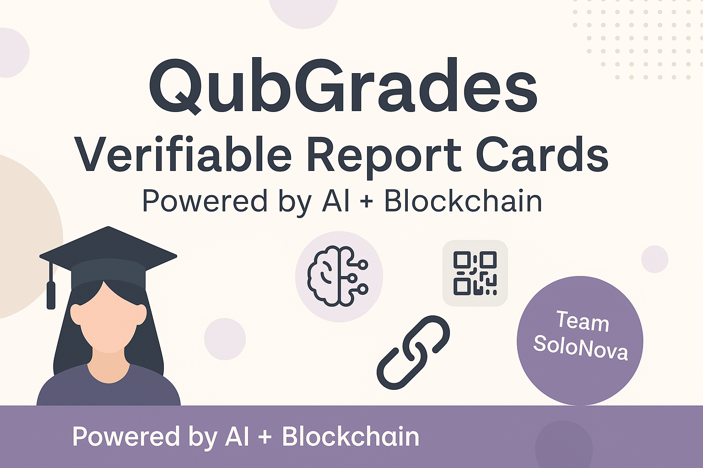

# QubGrades – Verifiable Report Cards
QubGrades is a modern, AI-powered report card generator that produces downloadable, verifiable academic reports with QR code and institution logo support. 

  

### 🚀 Built by Team **SoloNova** – Qubic Track | RAISE Your Hack 2025

**QubGrades** is an innovative web application that generates smart and aesthetic student report cards, using AI for performance summaries and **mock Qubic blockchain integration** for report authenticity and verification. It empowers institutions and students with **trust, transparency, and tamper-proof records**—all in just a few clicks.

---

## 🔗 Powered by Qubic

> **Qubic’s simulated functionality** is used to showcase decentralized verification. Each report card is assigned a **unique mock Qubic hash ID**, displayed as a **QR code**, and can be verified by inputting the Report ID. This highlights the potential of how education records can be decentralized using **Qubic-based smart infrastructure**.

---

## 🔍 Features

- 🎓 Generate clean, minimal, professional report cards
- 🤖 AI-generated performance summaries based on marks
- 🔐 Simulated **Qubic hash generation** for each report
- 🧾 QR code-based verification for authenticity
- 📎 Upload institution logos for branding
- 🖨️ Export as **PDF** or **PNG**
- ✅ Input a Report ID to verify any report instantly
- 🌿 Mobile-responsive & aesthetic UI for modern usability

---

## 💡 How It Works

1. Fill in student details and subject-wise marks.
2. Optionally upload the school or institution logo.
3. Click **Generate Report** to create the card.
4. A **mock Qubic Report ID** is generated and encoded into a **QR code**.
5. You can later **verify this ID** using the “Verify Report” section.
6. Download the card as **PDF or Image**.

---

## 🧪 Tech Stack

- **Frontend:** HTML, CSS, JavaScript
- **Libraries Used:**
  - [`html2pdf.js`](https://github.com/eKoopmans/html2pdf) – for PDF export
  - [`html2canvas`](https://html2canvas.hertzen.com/) – for PNG image generation
  - [`qrcode.js`](https://davidshimjs.github.io/qrcodejs/) – for rendering report QR code

---

## 🌐 Live Deployment

Live Demo 👉 **[https://aanyakathuria.github.io/qubgrades](https://aanyakathuria.github.io/qubgrades)**

---

## 📷 Preview

  

---

## 👨‍💻 Built with Passion by **Team SoloNova – Qubic Track**

| Name             | Role                                   |
|------------------|----------------------------------------|
| Aanya Kathuria   | Solo Developer (Frontend + Logic + UI) |

---

## 📄 License

This project is licensed under the **MIT License**.  
Please see the `LICENSE` file for more information.

---

## 🙌 Let's Connect

Have ideas? Want to collaborate or contribute?  
Open an issue or reach out on [GitHub Discussions](https://github.com/aanyakathuria/qubgrades/discussions).

> Together, let’s reimagine trust in education records using Qubic.

